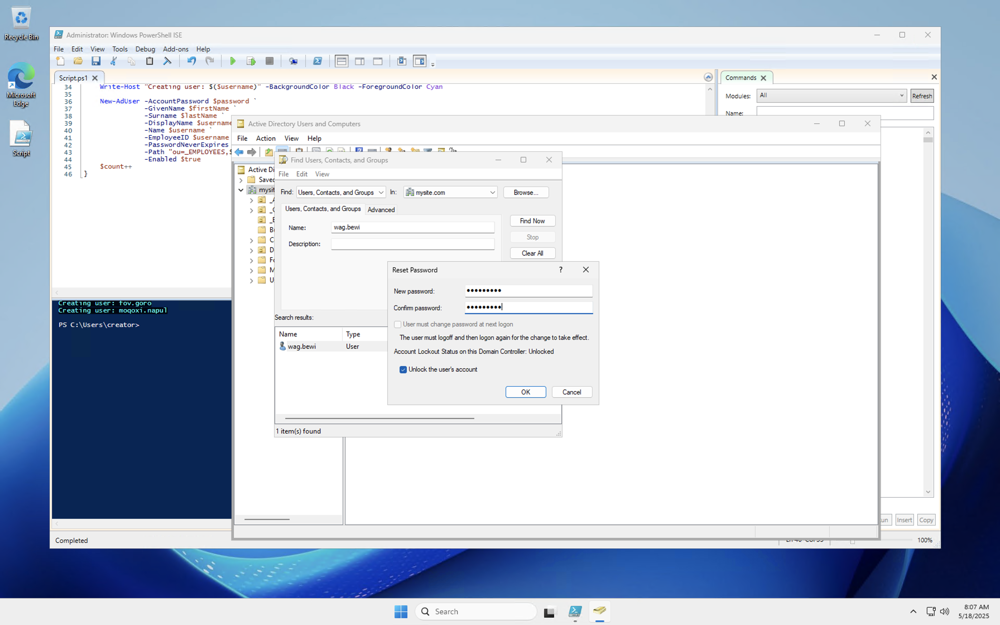
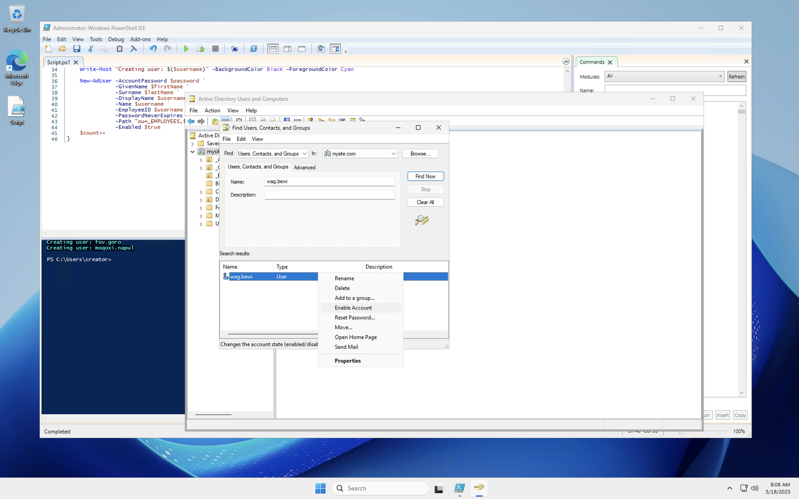
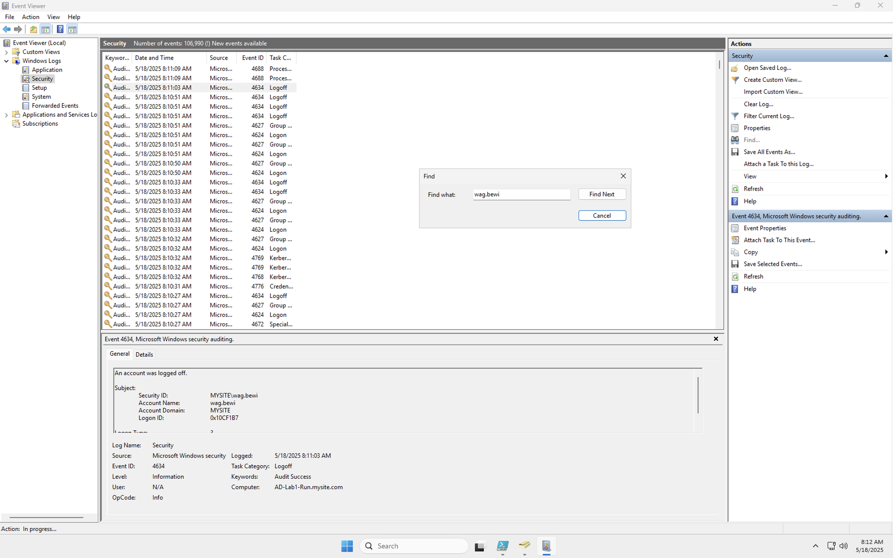
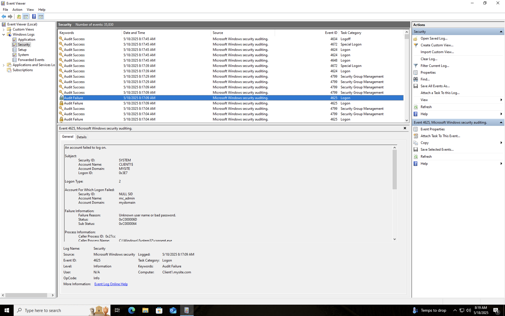

# 🔐 Active Directory Password Reset & Account Unlock

This project demonstrates how to reset a user's password and unlock a locked-out account in Active Directory using GUI tools and PowerShell, then verify the outcome using Event Viewer. This is an essential process for IT support and systems administration roles.

---

## 📂 Project Structure

---

## 🛠️ Procedure Overview

### 1. Detect Account Lockout
- User is unable to log in after repeated failed attempts.
- Remote Desktop error: `0x07 - Account locked due to too many failed sign-in attempts`.
- 

### 2. Locate User in Active Directory
- Open **Active Directory Users and Computers (ADUC)**.
- Search for the locked user (e.g., `wag.bewi`).
- 

### 3. Reset Password and Unlock Account
- Right-click the user → Reset Password.
- Ensure **"Unlock the user's account"** is checked.
- 
- 

### 4. Confirm Login on Client
- Log into the client machine using new credentials.
- Run `whoami` to verify domain and identity.
- 

---

## 🔍 Verify via Event Viewer

### 5. Search for Audit Events
- Open **Event Viewer** → Windows Logs → Security.
- Search for the username to track login events.
- 
- 

---

## 🎯 Learning Outcomes

By completing this project, you will:

- ✅ Understand how account lockouts occur in Active Directory environments
- ✅ Learn to reset a password and unlock a user account using ADUC
- ✅ Gain experience reading authentication events in Event Viewer
- ✅ Strengthen documentation skills for IT support scenarios
- ✅ Develop troubleshooting habits essential to helpdesk or sysadmin roles

---

## 🛠️ Troubleshooting Tips

| Problem | Solution |
|--------|----------|
| **Error 0x07: Too many failed attempts** | Wait for lockout policy duration or manually unlock via ADUC. |
| **Can't find user in ADUC** | Make sure you’re searching the correct OU or domain scope. |
| **User still can't log in after reset** | Confirm the new password meets domain policies and that it's correctly typed. |
| **Event Viewer shows failures after reset** | Check for cached credentials, group policy conflicts, or incorrect domain targets. |
| **Still locked out after reset** | Reset again and ensure “Unlock account” checkbox is enabled before applying.

---

## ✅ Summary

This lab simulates a common support scenario where a domain user is locked out. You'll walk through the reset and verification process, documenting each step with screenshots and logs — ideal for an entry-level IT support or cybersecurity portfolio.

---

## 📬 Contact

Feel Free to reach out on [LinkedIn](https://www.linkedin.com/in/kevindeonbrown)!

